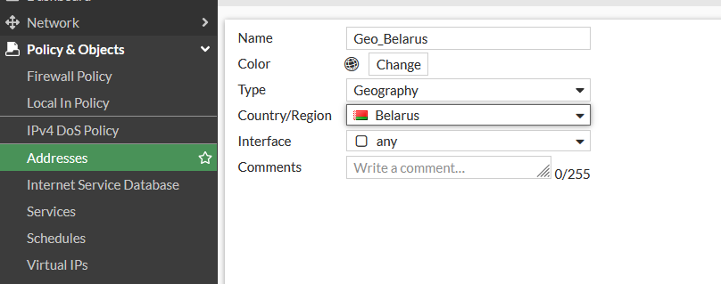
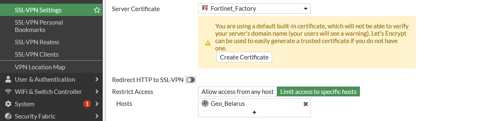
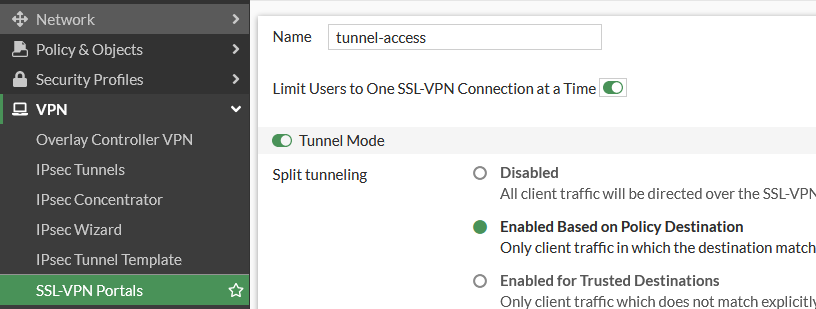

## Настройка Threat Feeds

Раздел Security Fabric  - External Connectors - Threat Feeds  позволяет подключать внешние источники данных, такие как:
* обновляемые txt файлы со списками вредоносных ip адресов расположенные на внешних веб-серверах (работает даже если лицензии истекли)
* обновляемые списки хэшей файлов вредоносного ПО расположенные на внешних веб-серверах 


### Где брать списки 


### Как подключать IP address  обновляемые txt файлы и хеши

В интернете есть большое количество компаний по ИБ, которые предоставляют платные и бесплатные доступы к таким обновляемым спискам:

* https://urlhaus.abuse.ch/
    Здесь нас интересует раздел https://urlhaus.abuse.ch/api/ и ссылки Plain-Text

* https://www.dan.me.uk/torlist/

* https://phishing.army

* https://bazaar.abuse.ch/export/  - malware hashes - здесь нам нужны  SHA256 hashes (https://bazaar.abuse.ch/export/txt/sha256/recent/)


Создаём Threat Feed


Рекомендую выставлять поле Refresh Rate на 30 и более минут, часто сайты которые предоставляют такие списки, ограничивают частоту доступа к таким спискам.

Обновляем Threat Feed


Далее создаём входящие и исходящие правила с блокировкой (DENY) доступа к данным спискам, данные правила должны располагаться выше разрешающих правил.

Для включения Malware hashes необходимо зайти в Security Profiles - Antivirus

выбрать необходимый профиль и включить "User External Malware Block List"


после этого зайти в консоль FTG и проверить, что хэши подгрузились, команды для проверки в зависимости от версии прошивки FGT:

```
diagnose sys scanunit file-hash list 
diagnose sys scanunit malware-list list
```


## Настройка безопасности SSL VPN


Посмотреть текущие настройки ssl vpn:

```
show vpn ssl settings
```


Создаём сетевые объекты по ГЕОпризнаку.




Ограничиваем доступ к SSL VPN подключениям по определенным странам.





Ограничиваем количество одновременных подключений 

через графический интерфейс:



через консоль:

```
config vpn ssl web portal
    edit "full-access"
        set limit-user-logins enable
end

```

Настраиваем блокировку пользователя на 15 минут, после 3ех неудачных попыток ввода пароля

```
config vpn ssl settings
    set login-attempt-limit 3
    set login-block-time 900
end
```


По умолчанию все пользователи, которые пытаются подключиться(даже если их не существует), попадают на дефолтный портал,
это можно увидеть в VPN-SSL VPN Settings в разделе Authentication/Portal Mapping.

Для минимизации площади атак создаём портал без доступа и ставим его по умолчанию, то есть все пользователи вне назначенных для них
порталов будут попадат на данный портал.


Создаём портал:

```
config vpn ssl web portal
    edit FakePortal
        set tunnel-mode disable
        set web-mode disable
        set ipv6-tunnel-mode disable
    next
end
```

Настраиваем его порталом по умолчанию:

```
config vpn ssl setting
        set default-portal FakePortal
end
```

Включаем более высокую версию протокола шифрования

```
config vpn ssl settings
        set ssl-min-proto-ver tls1-2
end
```


Лучше включать 1.3, но у Forticlient с этим есть проблемы на части ОС.


