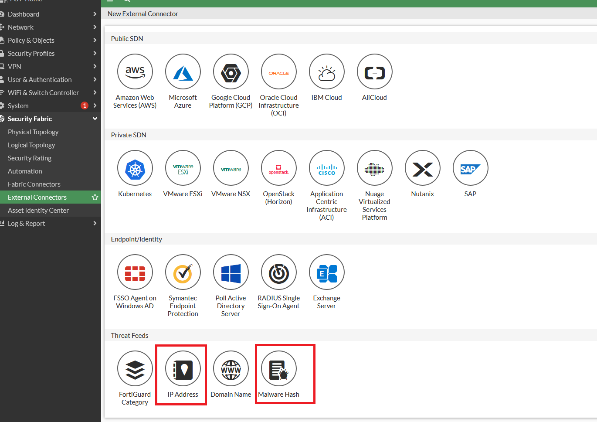
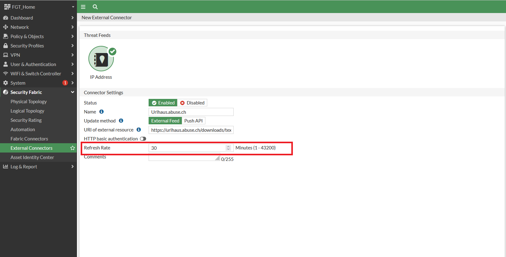
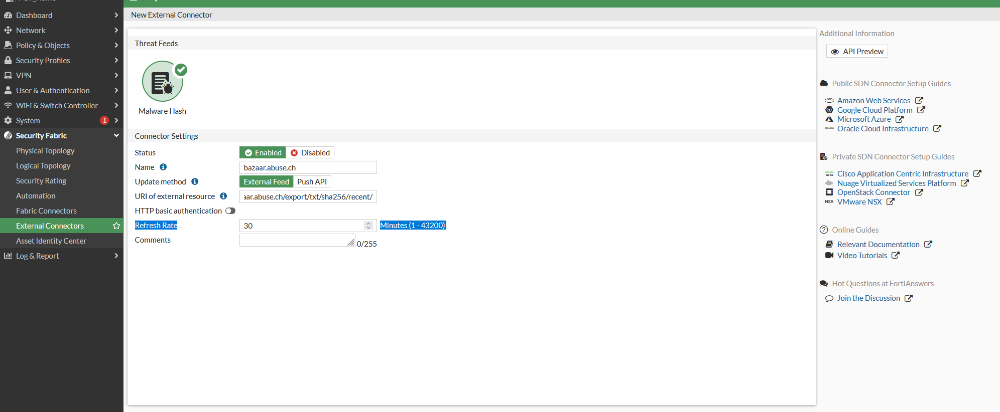
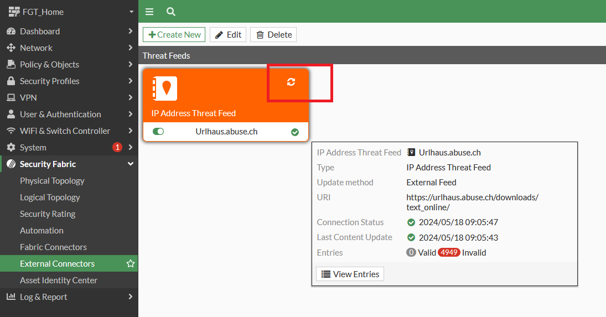
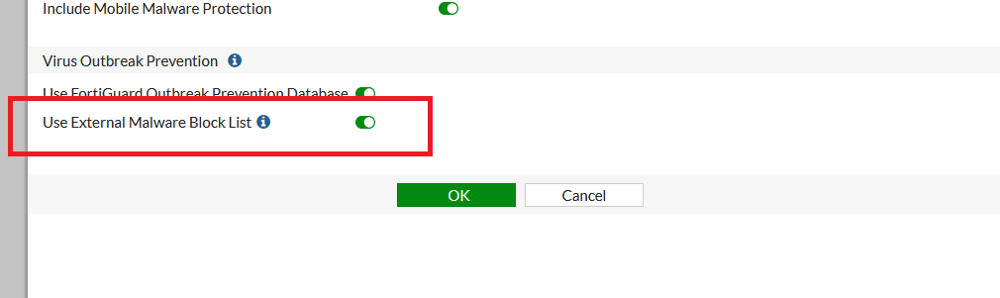
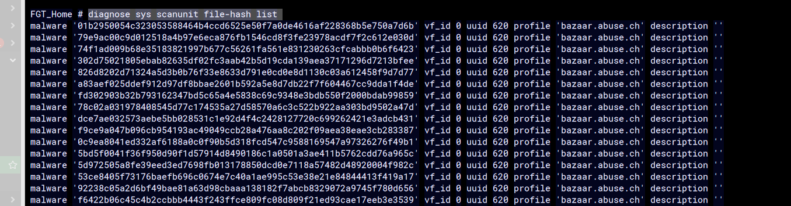

Настройка Threat Feeds

Раздел Security Fabric  - External Connectors - Threat Feeds  позволяет подключать внешние источники данных, такие как:
* обновляемые txt файлы со списками вредоносных ip адресов расположенные на внешних веб-серверах (работает даже если лицензии истекли)
* обновляемые списки хэшей файлов вредоносного ПО расположенные на внешних веб-серверах 





## Где брать списки 


## Как подключать IP address  обновляемые txt файлы и хеши

В интернете есть большое количество компаний по ИБ, которые предоставляют платные и бесплатные доступы к таким обновляемым спискам:

* https://urlhaus.abuse.ch/
    Здесь нас интересует раздел https://urlhaus.abuse.ch/api/ и ссылки Plain-Text

* https://www.dan.me.uk/torlist/

* https://phishing.army

* https://bazaar.abuse.ch/export/  - malware hashes - здесь нам нужны  SHA256 hashes (https://bazaar.abuse.ch/export/txt/sha256/recent/)


Создаём Threat Feed





Рекомендую выставлять поле Refresh Rate на 30 и более минут, часто сайты которые предоставляют такие списки, ограничивают частоту доступа к таким спискам.

Обновляем Threat Feed




Далее создаём входящие и исходящие правила с блокировкой (DENY) доступа к данным спискам, данные правила должны располагаться выше разрешающих правил.

Для включения Malware hashes необходимо зайти в Security Profiles - Antivirus

выбрать необходимый профиль и включить "User External Malware Block List"



после этого зайти в консоль FTG и проверить, что хэши подгрузились, команды для проверки в зависимости от версии прошивки FGT:

```
diagnose sys scanunit file-hash list 
diagnose sys scanunit malware-list list
```



